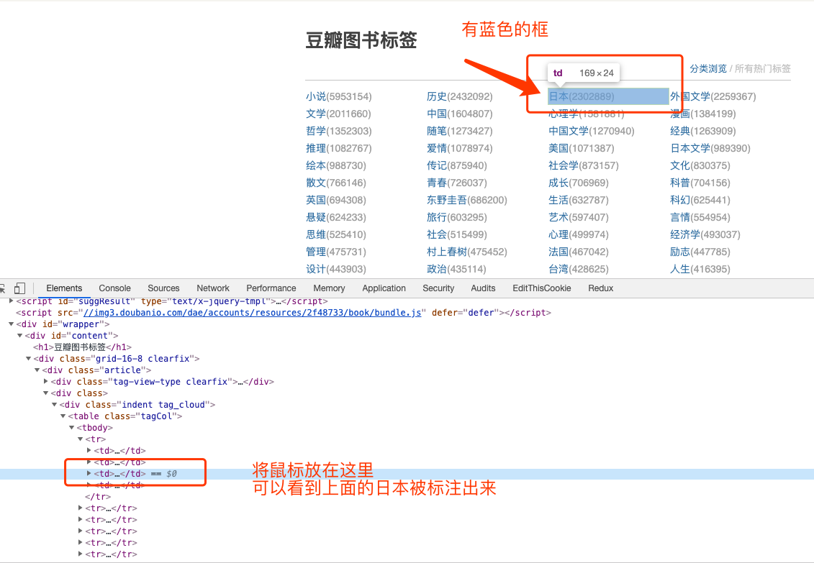

# 网络请求和解析

## requests 包

requests 包是一个 Python 网络请求库

- [github](https://github.com/request/request)
- [教程](https://2.python-requests.org//zh_CN/latest/user/quickstart.html)

```shell script
pip install requests
```

## lxml 包

lxml 包是一个 HTML 解析器

- [网站](https://lxml.de)

```shell script
pip install lxml
```

### 使用

### 获取"豆瓣图书标签"的网页内容

```python
# 导入包
import requests

# 豆瓣图书标签的 URL 
url = 'https://book.douban.com/tag/?view=cloud'
 
# 发起请求 
r = requests.get(url)

# 打印结果
print(r.text)
```

### 解析"豆瓣图书标签"的内容




```python
# 导入包
import requests
from lxml.etree import HTML

# 豆瓣图书标签的 URL 
url = 'https://book.douban.com/tag/?view=cloud'
 
# 发起请求 
r = requests.get(url)

# 解析
html = HTML(r.text)

trs = html.xpath('//table[@class="tagCol"]/tbody/tr')
for tr in trs:
    tds = tr.xpath('td')
    for td in tds:
        title = td.xpath('a').pop().text
        href = 'https://book.douban.com' + td.xpath('a').pop().attrib.get('href', '')
        count = td.xpath('b').pop().text.replace('(', '').replace(')', '')
        print({'title':title, 'href':href, 'count':count})
```

结果

```text
{'title': '小说', 'href': 'https://book.douban.com/tag/小说', 'count': '5953185'}
{'title': '历史', 'href': 'https://book.douban.com/tag/历史', 'count': '2432107'}
{'title': '日本', 'href': 'https://book.douban.com/tag/日本', 'count': '2302905'}
{'title': '外国文学', 'href': 'https://book.douban.com/tag/外国文学', 'count': '2259373'}
{'title': '文学', 'href': 'https://book.douban.com/tag/文学', 'count': '2011673'}
{'title': '中国', 'href': 'https://book.douban.com/tag/中国', 'count': '1604819'}
{'title': '心理学', 'href': 'https://book.douban.com/tag/心理学', 'count': '1581893'}
{'title': '漫画', 'href': 'https://book.douban.com/tag/漫画', 'count': '1384204'}
.....
```
