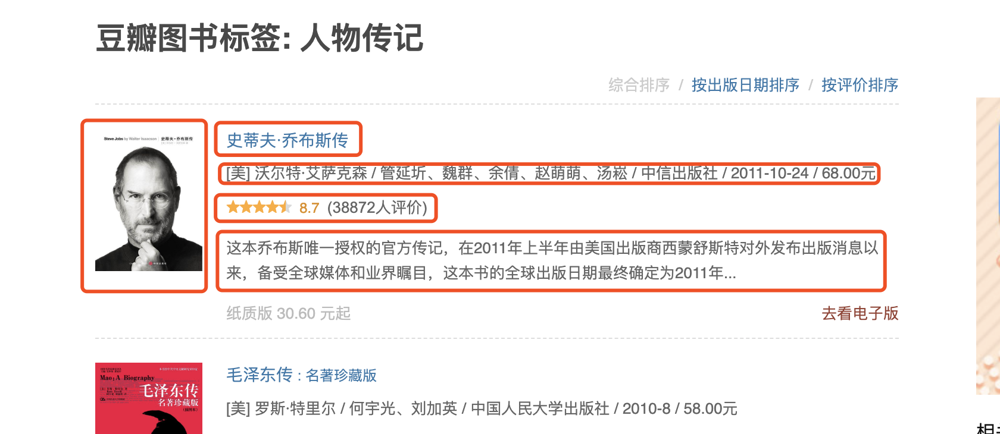

# Scrapy 解析书籍信息

#### 创建爬取数据信息的爬虫

位置：

```text
douban_book/spiders/douban_book_list.py
```




```python
import scrapy

class DoubanBookListSpider(scrapy.Spider):
    name = 'douban_book_list'
    allowed_domains = ['book.douban.com']
    start_urls = ['https://book.douban.com/tag/小说']

    def parse(self, response):
        lis = response.xpath('//ul[@class="subject-list"]/li')
        for li in lis:
            img = li.xpath('div[1]/a/img').attrib.get('src', '')
            info_attr = li.xpath('div[2]/h2/a').attrib
            href = info_attr.get('href', '')
            title = info_attr.get('title', '')
            about = li.xpath('div[2]/div').css('::text').get().strip()
            rate = li.xpath('div[2]/div[2]/span[2]').css('::text').get()
            rate_count = li.xpath('div[2]/div[2]/span[3]').css('::text').get().strip()
            desc = li.xpath('div[2]/p').css('::text').get()
            yield {
                'img': img,
                'href': href,
                'title': title,
                'about': about,
                'rate': rate,
                'rate_count': rate_count,
                'desc': desc,
            }

        next = response.xpath('//span[@class="next"]/a').attrib.get('href', '')
        if next:
            next = f'https://book.douban.com{next}'
            yield scrapy.Request(next, callback=self.parse)
```